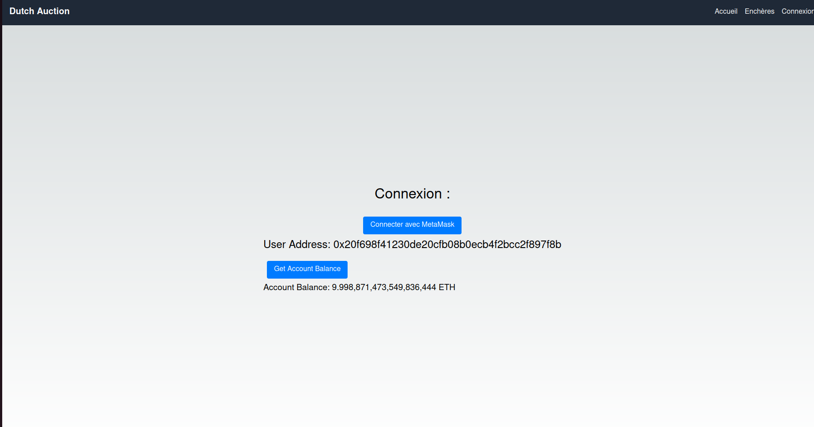
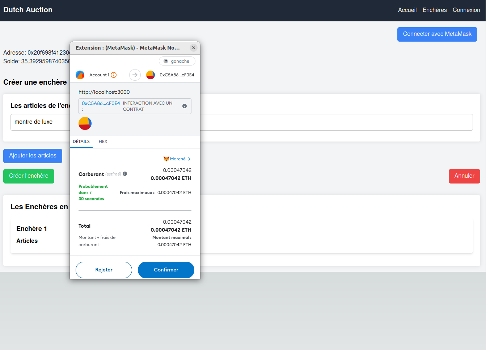
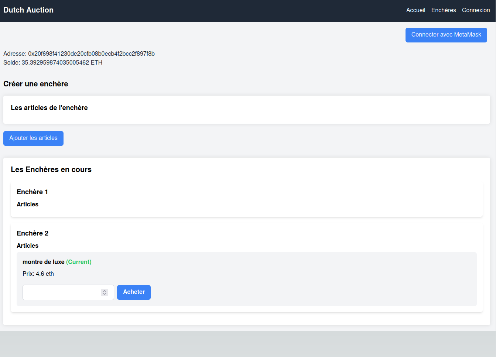
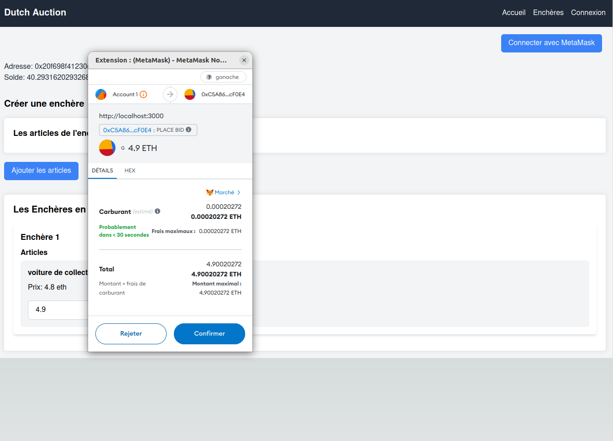
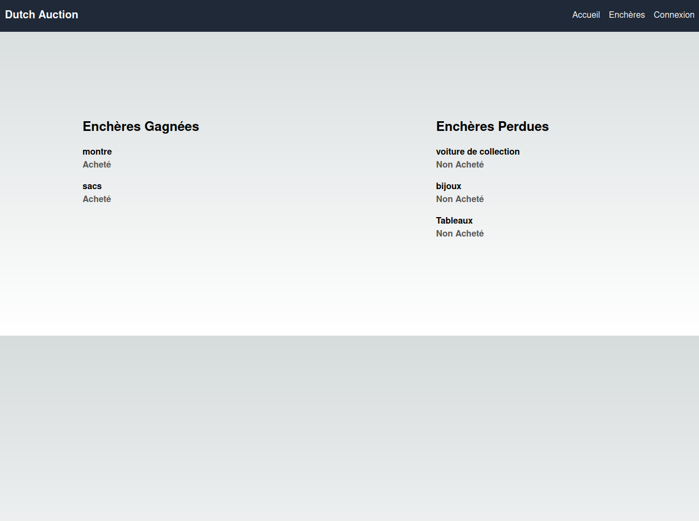

# Application décentralisée d'enchères hollandaises

|   Nom   | Prénom |
|---------|--------|
|   OUATAR   |  Hakim  |

Le TP est à réaliser individuellement.

## Présentation

Ce TP est le prolongement du premier et consiste à créer une application décentralisée (dApp) permettant de donner vie à votre Smart Contract (SC). Celle-ci doit pouvoir proposer les fonctionnalités suivantes.

### Authentification et profil

Il doit être possible de se connecter à l'aide de son portefeuille MetaMask. Vous pouvez utiliser la SDK de [MetaMask](https://docs.metamask.io/wallet/how-to/connect/set-up-sdk/).

Les données du portefeuille telles que l'adresse publique et le solde en ETH doivent être visibles depuis l'application.

### Enchères

La gestion des enchères est composée des éléments suivants :
- Une liste des enchères disponibles ;
- Créer une enchère avec les paramètres souhaités par le propriétaire ;
- Participer à une ou plusieurs enchères ;
- Pouvoir enchérir ;
- Cloturer une enchère (versement des fonds au propriétaire de l'enchère) ;
- Un tableau de bord permettant de visualiser les enchères gagnées, en cours ou perdues.

*N'oubliez pas de créer une barre de navigation pour accéder aux différentes fonctionnalités.*

Pour interagir avec la blockchain depuis votre application, il existe plusieurs bibliothèques telles que [ethers](https://docs.ethers.org/v5/) ou encore [web3js](https://web3js.readthedocs.io/en/v1.10.0/).

## Restitution

**Un rapport concernant l'utilisation de l'application sera à restituer 3 semaines après le dernier TP.**

Pour ce projet, il est imposé d'utiliser le framework [NextJS](https://nextjs.org/) qui utilise la bibliothèque [React](https://react.dev/).

## Installation

Pour créer une application NextJS, utilisez la commande suivante : 
```shell
npx create-next-app@latest
```

# Application d'enchères hollandaises décentralisée

## Introduction

Ce rapport présente l'application d'enchères hollandaises décentralisée (dApp) dans le cadre d'un projet. L'objectif de cette application est de permettre aux utilisateurs de participer à des enchères décentralisées en utilisant MetaMask comme portefeuille et en interagissant avec des contrats intelligents sur la blockchain Ethereum.

## Fonctionnalités

L'application offre les fonctionnalités suivantes :

### 1. Authentification et Profil

L'authentification dans l'application se fait via MetaMask. Les utilisateurs peuvent se connecter à leur compte MetaMask, ce qui leur permet d'accéder à leur compte et de visualiser des informations telles que leur adresse publique et leur solde en ETH directement depuis l'application.


### 2. Enchères

#### 2.1 Liste des Enchères Disponibles

Les utilisateurs peuvent visualiser toutes les enchères disponibles sur la plateforme, avec des détails sur chaque enchère telles que le nom, la description et les articles inclus.

#### 2.2 Création d'une Enchère

Les utilisateurs peuvent créer de nouvelles enchères en ajoutant des articles à l'enchère et en spécifiant des détails tels que le nom, la description et le prix de réserve. Une fois que tous les détails sont renseignés, l'utilisateur peut finaliser la création de l'enchère en appuyant sur le bouton "Créer l'enchère".


#### Enchère crée : 


#### 2.3 Participation à une Enchère

Les utilisateurs peuvent participer à une ou plusieurs enchères en enchérissant sur celles qui les intéressent. Ils peuvent spécifier le montant qu'ils sont prêts à offrir et soumettre leur offre. Lorsque la durée de l'enchère expire, celle-ci est automatiquement clôturée.
#### Achat d'un article 



#### 2.4 Suivi des Enchères Gagnées et Perdues

Les utilisateurs peuvent suivre les enchères qu'ils ont remportées et celles qu'ils ont perdues. Les enchères gagnées sont affichées dans la section "Enchères Gagnées" tandis que les enchères perdues sont affichées dans la section "Enchères Perdues". Cela permet aux utilisateurs de garder une trace de leurs transactions passées.




## Utilisation

Pour utiliser l'application, les utilisateurs doivent installer MetaMask et disposer d'un portefeuille Ethereum avec des fonds suffisants pour participer aux enchères. Ils peuvent ensuite se connecter à l'application à l'aide de leur compte MetaMask et commencer à participer aux enchères disponibles.

## Conclusion

L'application d'enchères hollandaises décentralisée offre une plateforme transparente et sécurisée pour les utilisateurs souhaitant participer à des enchères décentralisées sur la blockchain Ethereum. Avec des fonctionnalités telles que l'authentification via MetaMask, la création d'enchères et le suivi des enchères gagnées et perdues, l'application offre une expérience utilisateur conviviale pour les amateurs d'enchères en ligne.
